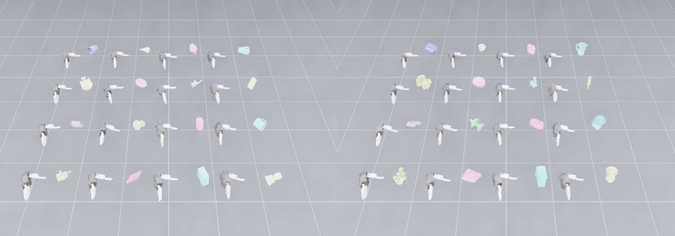
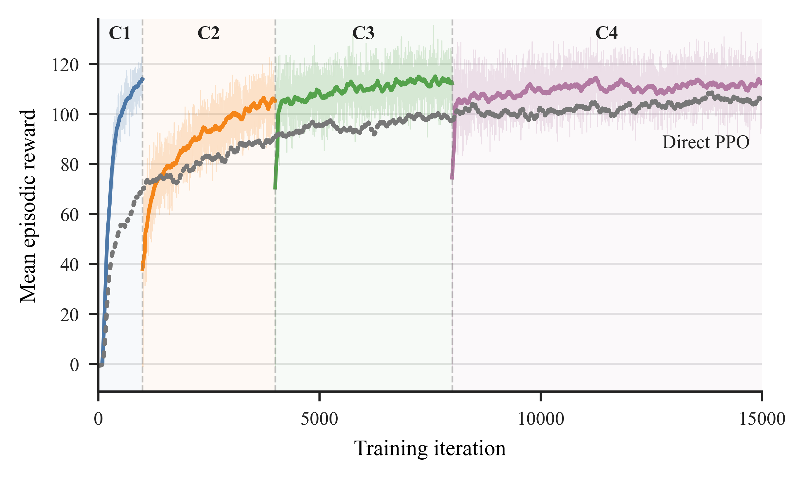

#  ivagrasp-isaaclab

[English](README.md) | 简体中文

[](https://github.com/HomeworldL/ivagrasp-isaaclab/actions/workflows/ci.yml)
[](ENVIRONMENT.md)
[](LICENSE)

本项目基于 [Isaac Lab](https://github.com/isaac-sim/IsaacLab)，研究灵巧手对自由漂浮物体的抓取。代码支持在可配置的物体集合上训练使用完整状态的 teacher，并将策略蒸馏给使用部分观测的 student。LiberHand、Allegro 和 Inspire 灵巧手均有静止物体与运动物体任务。在多物体训练中，同一批并行环境可以分别使用物体集合中的不同物体。

**Teacher（左）· Student（右），16 个并行环境**

[](assets/media/multi-object-comparison.mp4)

两侧画面均从接触前开始，只展示一次抓取，中途没有环境重置，并以录制速度的 0.4 倍播放。每个环境中放置一个物体。也可单独查看 [teacher](assets/media/multi-object-teacher.mp4) 和 [student](assets/media/multi-object-student.mp4) 视频；近景视频：[罐子 teacher](assets/media/can-teacher.mp4) / [student](assets/media/can-student.mp4)、[电钻 teacher](assets/media/drill-teacher.mp4) / [student](assets/media/drill-student.mp4)。

下图展示一次较早训练中，四个物体集合训练阶段的平均每回合奖励。它反映训练过程，不代表抓取成功率。



## 安装

使用 Ubuntu 22.04、NVIDIA GPU 和名为 `isaaclab` 的 Conda 环境。以下命令对应[记录的开发环境](ENVIRONMENT.md)：Python 3.11、Isaac Sim 5.1.0、CUDA 12.8 版本的 PyTorch 2.7.0，以及指定的 Isaac Lab 提交。系统依赖和驱动要求请参考 [Isaac Lab 安装指南](https://isaac-sim.github.io/IsaacLab/main/source/setup/installation/index.html)。

```bash
conda create -n isaaclab python=3.11.15 -y
conda activate isaaclab
python -m pip install 'isaacsim[all,extscache]==5.1.0' --extra-index-url https://pypi.nvidia.com
python -m pip install torch==2.7.0 torchvision==0.22.0 --index-url https://download.pytorch.org/whl/cu128

git clone https://github.com/isaac-sim/IsaacLab.git
git -C IsaacLab checkout d94504bcf91cb7ab7ff956a2d48ecd1bca82797a
(cd IsaacLab && ./isaaclab.sh --install rsl_rl)
export ISAACLAB_ROOT="$(pwd)/IsaacLab"

git clone https://github.com/HomeworldL/ivagrasp-isaaclab.git
cd ivagrasp-isaaclab
```

以下命令均在本仓库根目录运行。`./isaaclab.sh` 会调用 `$ISAACLAB_ROOT/isaaclab.sh`；本仓库直接以源码方式使用，无须构建或安装 wheel。训练和回放脚本中仍保留旧机器的 `/home/ccs/github/IsaacLab/scripts/reinforcement_learning/rsl_rl` Python 搜索路径。你的机器上可以没有这个目录，但需要在当前环境中安装 Isaac Lab 和 RSL-RL。

## 准备物体数据

本仓库不包含物体数据集或 checkpoint。按公开的 [dexgrasp_sample 指南](https://github.com/HomeworldL/dexgrasp_sample/blob/main/README.md#dataset-construction) 准备物体资源、转换为 USD，并生成形状聚类及强化学习数据划分元数据。将下面的路径指向生成的目录：

```bash
export DATASET_ROOT=/path/to/dexgrasp_sample/datasets/objdata_YCB
export RL_SPLIT_DIR="$DATASET_ROOT/_meta/rl_split/<split_tag>"
```

Python 脚本的默认值仍包含原机器路径，因此要显式传入 `--dataset-root` 和 `--rl-split-dir`；仅导出上述环境变量不会改变脚本默认值。`--object-set-id` 需选用划分元数据中实际存在的 ID。

## 训练与回放

在一个物体集合上训练运动物体任务的 teacher：

```bash
./isaaclab.sh -p scripts/train_dexgrasp_moving.py \
  --headless --hand liberhand_right --mode teacher \
  --num-envs 128 --max-iterations 1000 \
  --dataset-root "$DATASET_ROOT" --rl-split-dir "$RL_SPLIT_DIR" \
  --object-set-id 'train@cluster@cluster0_topk1@s120_120'
```

在同一物体集合上回放训练得到的 checkpoint：

```bash
./isaaclab.sh -p scripts/play_dexgrasp_moving.py \
  --hand liberhand_right --mode teacher \
  --checkpoint /path/to/model.pt \
  --dataset-root "$DATASET_ROOT" --rl-split-dir "$RL_SPLIT_DIR" \
  --object-set-id 'train@cluster@cluster0_topk1@s120_120'
```

静止物体任务使用 `scripts/train_dexgrasp_float.py` 和 `scripts/play_dexgrasp_float.py`，参数相同。训练 student 时使用 `--mode student --teacher-checkpoint /path/to/teacher.pt`；回放 student 时使用 `--mode student`。通过 `--hand allegro_right` 或 `--hand inspire_right` 选择其他灵巧手。训练生成的 checkpoint 位于 `logs/rsl_rl/` 下。

静止物体任务在重置时将物体的线速度和角速度设为零。运动物体任务在默认重置时独立采样各速度分量：`vx ∈ [0, 0.45] m/s`、`vy, vz ∈ [-0.05, 0.05] m/s`、`ωx, ωy, ωz ∈ [-0.35, 0.35] rad/s`。这些是各分量的范围，并非速度模长的范围。速度课程学习默认关闭；如需使用，训练时设置 `ENABLE_SPEED_CURRICULUM=1`。

无需 checkpoint 即可查看灵巧手资源：`./isaaclab.sh -p scripts/view_hand_usd.py --hands liberhand_right`。该命令需要 Isaac Sim，但不需要物体数据集。

## 许可

项目代码采用 [MIT 许可](LICENSE)。灵巧手资源可能适用不同条款，请查看[第三方资源声明](THIRD_PARTY_NOTICES.md)，尤其注意 Inspire Hand 的非商业许可。贡献方式见[贡献指南](CONTRIBUTING.md)。
